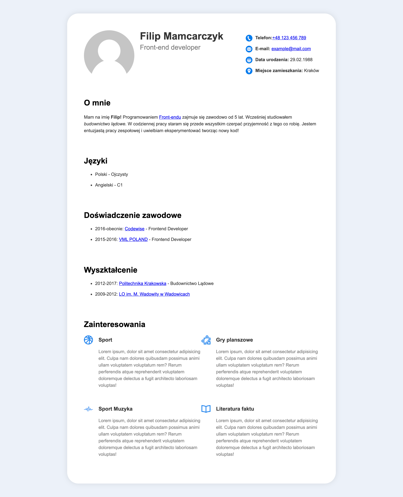
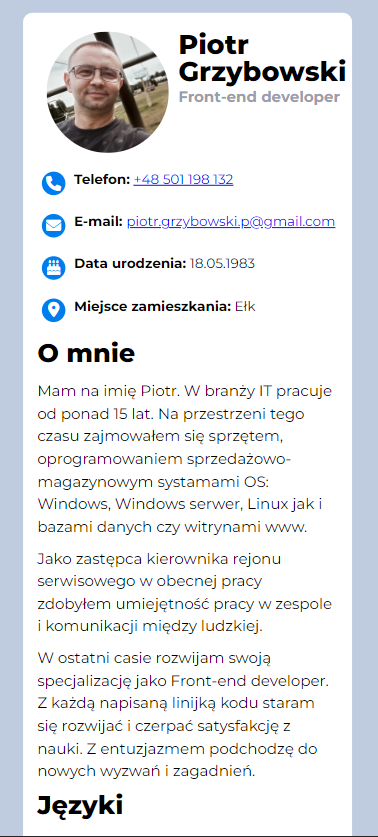
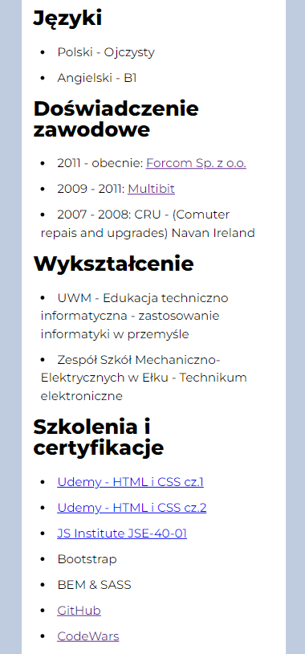
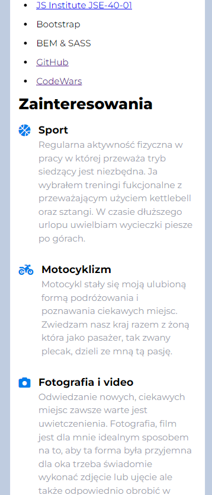
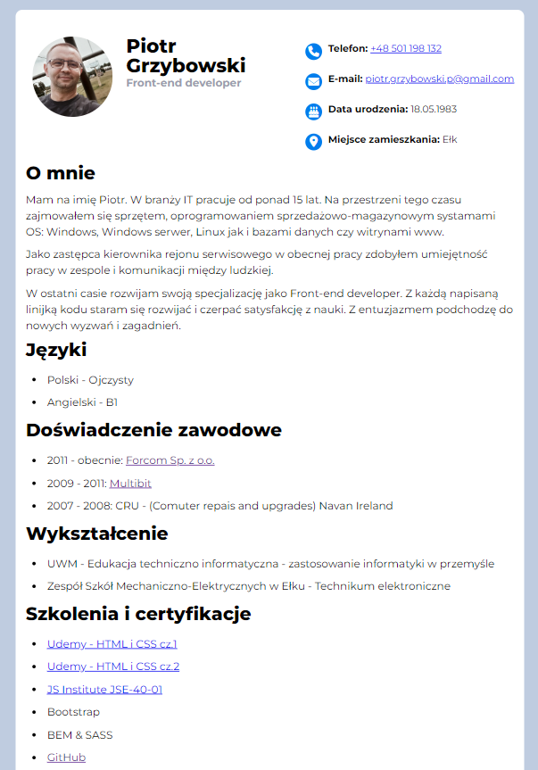
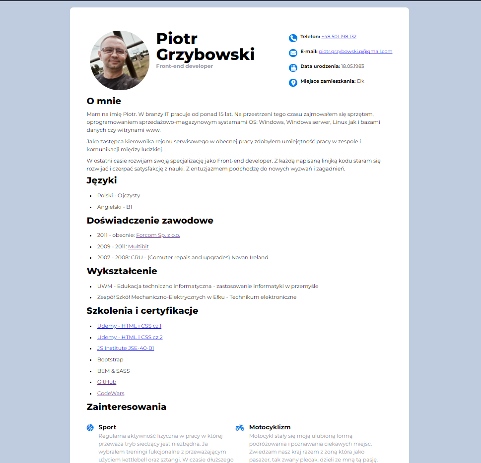

# Zadanie CV
Jest to strona z zadania newslettera [Jak zacząć programować](https://jakzaczacprogramowac.pl)

Zadanie polegało na odtworzeniu projektu w formie strony www przy użyciu HTML i CSS .

# Strona z rozwązaniem live: [Moje rozwiązanie](https://shroomsky.github.io/About_Me/)

##Zbudowane przy użyciu:

- Semantic HTML5 markup
- CSS custom properties
- Flexbox
- CSS Grid
- Mobile-first workflow

## [Podgląd na stronę]

### [Widok mobilny]

### [Widok tabletowy]

### [Widok desktopowy]

